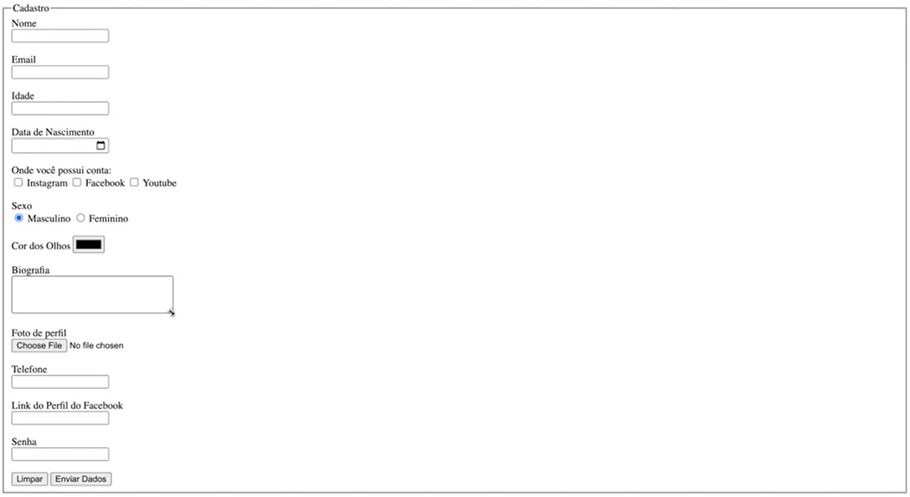

Formulário HTML

> O projeto envia o formulário do usuário.

### Ajustes e melhorias

O projeto ainda está em desenvolvimento e as próximas atualizações serão voltadas nas seguintes tarefas:

- [x] Conexão com o Banco de Dados
- [x] Integração com Back-end
- [x] Melhorias com CSS

## 🤝 Colaboradores

Agradecemos às seguintes pessoas que contribuíram para este projeto:

<table>
  <tr>
    <td align="center">
      <a href="#">
         
        
          <b>Iuri Silva</b>
        
      </a>
    </td>
    <td align="center">
      <a href="#">
         
        
          <b>Jean Henrique</b>
        
      </a>
    </td>
  </tr>
</table>
